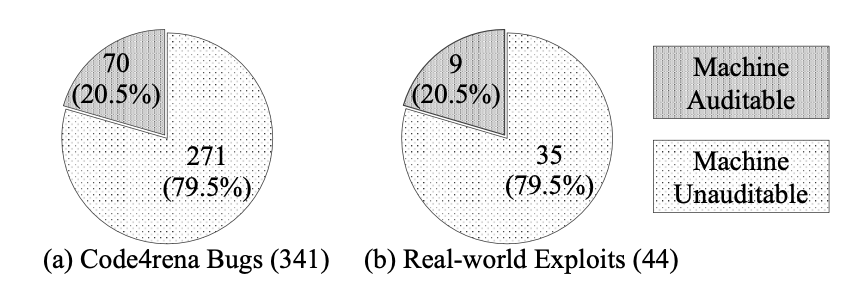

# CCS2024b-benchmark

This project is dedicated to the smart contract dataset of CCS2024b. The repository contains two datasets, including a labelled dataset with 110 annotated cases, and a real-world dataset derived from Code4rena contest.

## Dataset Description

### Labled Dataset:
- Contains 110 contract test cases divided into 11 subdatasets.
- Includes 10 subdatasets with known vulnerabilities in the Top 10 categories.
- Provides one subdataset with correct test cases.

### Real-world Dataset:
- For our study, we selected 100 contracts exhibiting a total of 349 high and medium-risk vulnerabilities. from Code4rena contest https://code4rena.com.

## Folder Description
The dataset is organized into three folders:
+ [labeled/](labeled/): 110 contract test cases divided into 11 subdataset,  where 10 sub-datasets each focus on a specific common vulnerability type, and the remaining sub-dataset consists of secure contracts.
+ [realworld/](realworld/): is derived from the Code4rena contests, encompassing 100 vulnerable smart contracts out of an expansive collection of 102 projects and 6,454 contracts in https://github.com/ZhangZhuoSJTU/Web3Bugs.
+ [reports/](reports/): contains all the reports.

## Top 10 categories:
1. Reentrancy
2. Arithmetic
3. Gasless send
4. unsafe suicidal
5. unsafe delegatecall
6. unchecked send
7. TOD
8. time manipulation
9. tx.origin
10. bad randomness

## Real-world dataset:
Here is an overview of the criteria and selection process used for selecting the 100 contracts from Code4rena:

- **Detailed Reports:** Each selected contract must have a corresponding detailed report describing the identified vulnerabilities.
- **Clear Contributor Attribution:** The reports must clearly attribute the contributions of the individuals who identified the vulnerabilities.
- **Vulnerability Classification:** Each report must contain at least two vulnerabilities classified as high or medium risk.
- **Diversity:** The similarity between any two selected contracts did not exceed 80%.
- **Vulnerability Type Distribution:** At least 10% of the bugs corresponded to each specific type of vulnerability.

According to [paper](https://ieeexplore.ieee.org/abstract/document/10172700) [1], vulnerabilities in smart contracts can be categorized as either machine-auditable or machine-unauditable. Their survey and experiments indicate that existing tools can detect machine-auditable vulnerabilities, with more than 80% of exploitable bugs falling into this category, as shown in Figure 1. However, these findings primarily consider traditional tools. With the advent of large language models (LLMs), it has become possible to identify machine-unauditable bugs. Similar to human experts, LLMs are starting to demonstrate the ability to detect complex vulnerabilities.

In our study, we selected 10 types of vulnerabilities, with the vulnerable contracts sourced from labeled datasets. For the real-world dataset, we did not limit the types of vulnerabilities. Consequently, we selected 100 contracts from the Code4rena contest, exhibiting a total of 349 high and medium-risk vulnerabilities. More information on the Code4rena contest can be found [here](https://code4rena.com).

In our study, we explored the ability of LLMs to detect a broad range of vulnerability types, including 32 complex logical types as follow:

- Oracle manipulation
- Ownership hijacking
- Centralization risks
- Single points of failure
- Minting permissions
- Funding rate calculation precision
- Flash loan vulnerabilities
- Precision loss
- Dependence on external data
- Discrepancies in balance calculation
- Cancellation authority issues
- Misuse of mapping getter
- Inefficient state modifications in a loop
- Incomplete implementation
- Redundant statements and syntax errors
- Unpredictable initialization
- Unnecessary comparison
- Misuse of `msg.sig` for authorization
- Owner's Absolute Control Over Critical Functions
- Missing Nonce Increment
- Off-chain Signature
- Potential Inconsistency in Yield Source Swapping
- Incorrect Signature Verification
- Signature Malleability
- Lack of Access Control for Sensitive Functions
- Uninitialized `creator` variable
- Constructor inheritance
- Constructor execution order
- Integer division resulting in loss of precision
- Redundant condition
- Lack of functionality
- Impracticality of exact match

